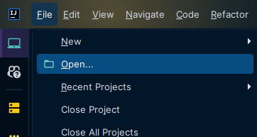
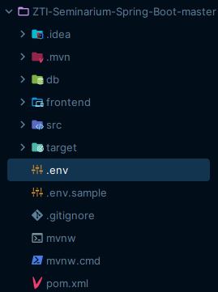
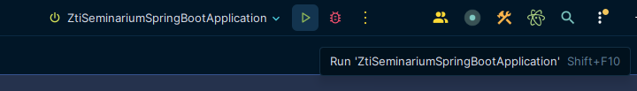

# ZTI Seminarium - Narzędzie Spring Boot
---

## Wymagania

- Java >= 21
- Node.js ^18.18.0 || >= 20
- npm >= 8

## Uruchomienie aplikacji serwera

1. Otworzyć projekt w IntelliJ IDEA (_File_ > _Open..._)

   
2. W katalogu głównym projektu utworzyć plik `.env` oraz podać wartości następujących zmiennych:
    - `spring.datasource.url` - adres URL bazy danych,
    - `spring.datasource.username` - nazwa użytkownika bazy danych,
    - `spring.datasource.password` - hasło do bazy danych.
    
    
3. Uruchomić backend poprzez naciśnięcie ikonki "Play", bądź poprzez kombinację klawiszy Shift + F10:
   
   

## Uruchomienie aplikacji klienta

1. Otworzyć terminal w katalogu głównym projektu.
2. Przejść do katalogu `frontend`:
```
cd frontend
```
3. Zainstalować pakiety potrzebne do uruchomienia aplikacji klienta:
```
npm install
```
4. Uruchomić frontend poprzez komendę:
```
npm run dev
```

Po uruchomieniu aplikacja powinna być dostępna w przeglądarce pod adresem: `http://localhost:5173/`.
